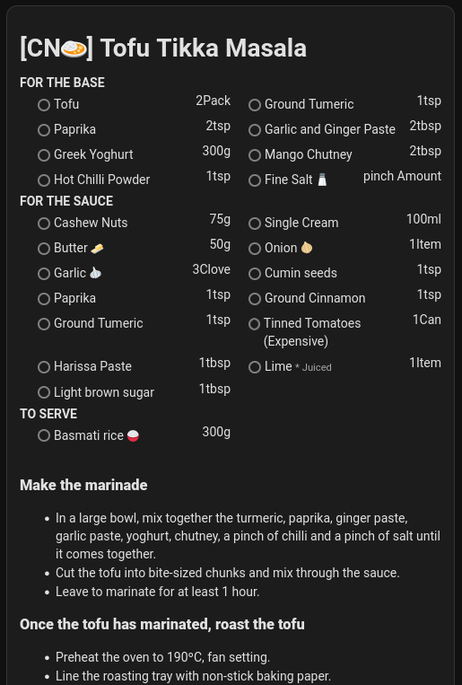
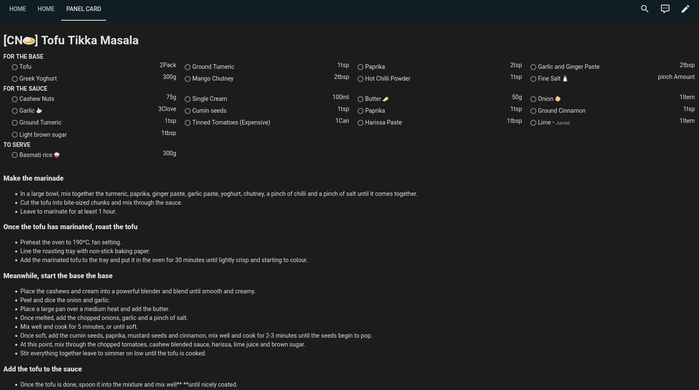

# Grocy Recipe Card
Have you got a Home Assistant tablet in your kitchen? Do you use [Grocy](https://grocy.info/) to manage your recipes? Then this card might be just what you're looking for.

Unlike other similar cards, this has the ability to display ingredients too!

> Disclaimer: In order to display the ingredients, some additional requests to your Grocy server are required and are performed within the card itself. I believe this is rather unconventional for HomeAssistant and ideally changes would be made to the Grocy integration however this seems to work for now.

## Configuration Options

| option | description | default | optional |
|------|--------|------|---|
| type | Tell HA you want to use this card | custom:grocy-recipe-card | no |
| entity | The meal_plan entity from the Grocy integration | none | no |
| grocyURL | The URL where your Grocy server is hosted | none | no |
| grocyAPIKey | A valid API key to access the Grocy server | none | no |
| ingredientsColumns | How many columns to split your ingredients list across | 2 | yes |
| showTitle | Should the title be displayed? | true | yes |
| showIngredients | Should the ingredients be displayed? | true | yes
| showMethod | Should the method/description be displayed? | true | yes |


## Screenshots
The card on a standard dashboard:  



The card taking up the entire screen in panel mode:  


How it looks on my actual kitchen dashboard:  


## Example
```yaml
type: custom:grocy-recipe-card
entity: sensor.grocy_meal_plan
ingredientsColumns: 3
grocyURL: https://en.demo.grocy.info
grocyAPIKey: 4s83x1gC8GnCWzcFcwsMoBsE5yESIAJYu3rSZZXlmZNoNYu2ub
```